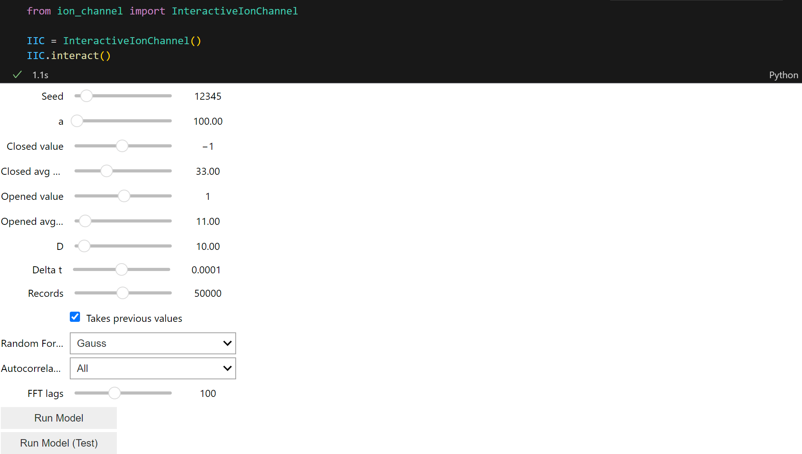
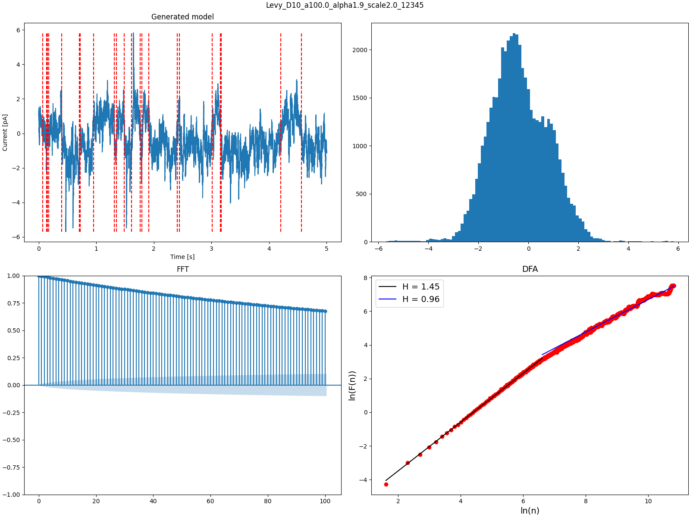

# JonUŚ - Ion Channel Model

## Description
Comprehensive and easy tool to generate time series representing **Ion Channel** using a mathematical model. 

Some properties, that the tool has are:
- easy to use inside a **Jupyter Notebook** framework,
- possibility to generate autocorrelation plots using modified [fathon](https://github.com/stfbnc/fathon/) example and ``statsmodels`` library,
- data is very well suited for training AI models for detecting breakpoints, but only for one channel models (maybe updated later to include multi-channel models).

Project was done for an engineering degree at University of Silesia.

## Visuals
Jupyter Notebok Framework

Sample Generated Data

## Installation
Best suited to use within a [Python Virtual Environment](https://virtualenv.pypa.io/en/latest/index.html), but can be installed right into PATH.

1. Clone the repository into desired directory on your system using:
    - SSH: ``git clone git@github.com:University-of-Silesia-Ion-Channel/Jonus.git`` or
    - https: ``git clone https://github.com/University-of-Silesia-Ion-Channel/Jonus.git``
2. Install requirements using: ``pip install -r requirements.txt``

And you're ready to rock and roll!

## Usage
Use attached ``interactable.ipynb`` notebook within your [IDE](https://en.wikipedia.org/wiki/Integrated_development_environment) to generate data. 

Yes, it's that simple.

## Support
Feel free to add any issues inside my repository.

## Roadmap
Perhaps a multichannel generator.

## Contributing
Feel free to edit, reproduce and deploy any changes done to my repository.

## Authors and acknowledgment
This project wouldn't be possible without help of:
- [DSc Łukasz Machura](https://lukaszmachura.github.io/)
- [PhD Paulina Trybek](https://www.researchgate.net/profile/Paulina-Trybek)

And my dearest friend: [BEng Jakub Kraus](https://www.researchgate.net/profile/Paulina-Trybek).

## License
[GNU Public License](LICENSE)

## Project status
Project is still in the works at this moment (*08.02.2025*).